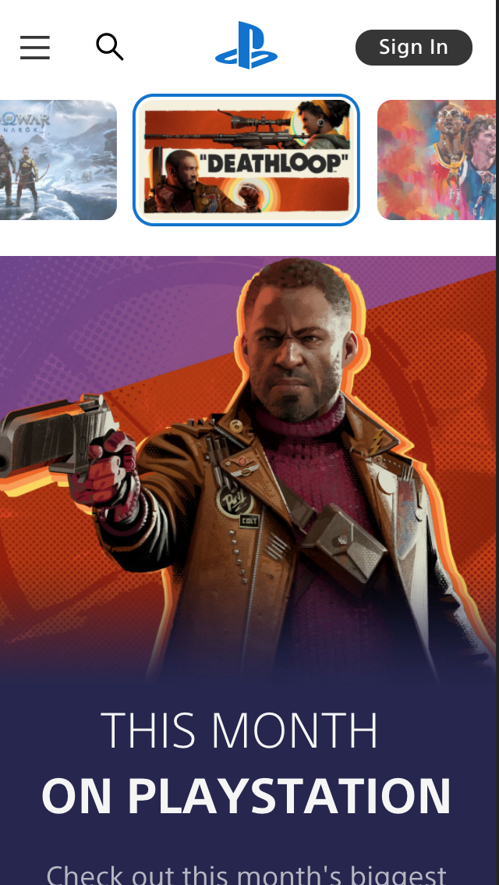
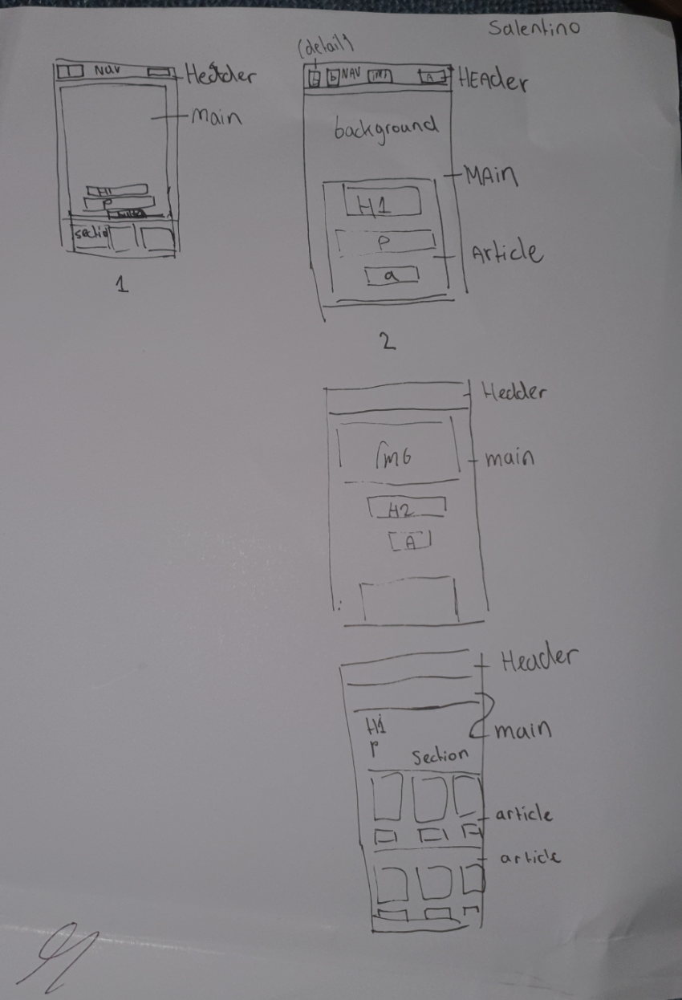

# Procesverslag
Markdown is een simpele manier om HTML te schrijven.  
Markdown cheat cheet: [Hulp bij het schrijven van Markdown](https://github.com/adam-p/markdown-here/wiki/Markdown-Cheatsheet).

Nb. De standaardstructuur en de spartaanse opmaak van de README.md zijn helemaal prima. Het gaat om de inhoud van je procesverslag. Besteedt de tijd voor pracht en praal aan je website.

Nb. Door *open* toe te voegen aan een *details* element kun je deze standaard open zetten. Fijn om dat steeds voor de relevante stuk(ken) te doen.

## Jij

uitwerken voor kick-off werkgroep

### Auteur:
Salentino Bommel

#### Je startniveau:
rood

#### Je focus:
surface
 

## Je website

uitwerken voor kick-off werkgroep

### Je opdracht:
https://www.playstation.com/en-us/

#### Screenshot(s) van de eerste pagina (small screen): 
hier de naam van de pagina  

#### Screenshot(s) van de tweede pagina (small screen):
hier de naam van de pagina  

 

## Breakdownschets (week 1)

uitwerken na afloop 2e werkgroep

### de hele pagina: 

### dynamisch deel (bijv menu): 

### wellicht nog een dynamisch deel (bijv filter): 

## Voortgang 1 (week 2)

uitwerken voor 1e voortgang

### Stand van zaken
Pagina 1 is bijna af, ik zou alleen nog meer uitleg over de breakpoints willen, ookal heb ik surface gekozen.

### Agenda voor meeting
samen met je groepje opstellen

Aniek

1. Meer info over breakpoint (2kolommen vanuit 1)
2. Details tag voor menu

Salentino

1. Misschien meer info over breakpoint
2. 

Yen
1. Wil weten hoe ze het moet aanpakken

### Verslag van meeting
hier na afloop snel de uitkomsten van de meeting vastleggen

- Feedback gehad op semantiek
- Verder geen opmerkingen 

## Voortgang 2 (week 3)

uitwerken voor 2e voortgang

### Stand van zaken
hier dit ging goed & dit was lastig (neem ook screenshots op van delen van je website en code)

### Agenda voor meeting
samen met je groepje opstellen

Aniek

1.  Wilt weten welke html elementen zij het beste kan gebruiken voor haar tweede pagina en of zij iframes mag gebruiken.

Salentino

1. Geen vragen

Yen      

### Verslag van meeting
We hebben Ons werk laten zien, verder had Aniek haar vragen gesteld.

## Toegankelijkheidstest (week 4)

uitwerken na test in 8e voortgang

### Bevindingen
Lijst met je bevindingen die in de test naar voren kwamen:

#### Voice over
Voice over was best ingewikkeld, omadt het best technisch en montoon is als beginner. 
Ik heb des ondanks het wel voor elkaar gekregen, om de voice over tekst te laten lezen.

#### Bril
Met de half zwarte kant bril kon im best nog wel zien. Ik denk vooral omdat het niet op mijn oog 
was dat ik daarom automatisch mijn hoofd ging draaien om iets te zien

#### Ballon
Het was vrij lastig om 2 dingen tegelijkertijd aan iets optimaal te werken

#### Elektrisch
Ik vond het zelf bijna niet te doen, vooral omdat je echt geen controle hebt tenzij je je arm aanspant.

## Voortgang 3 (week 4)

uitwerken voor 3e voortgang

### Stand van zaken
Pagina 1 en 2 zijn bijna af. Ik wil beginnen met de extra surface elementen

### Agenda voor meeting

Aniek wilde weten hoe ze een object van 1 naar 2 kolommen krijg en hoe zij een specifieke stijl kan krijgen bij een focus state.

Yen wilde weten hoe zij mijn hamburgericoon naar rechts krijg en hetzelfde als Aniek. En hoe ze een foto iets later kan laten verschijnen.

### Verslag van meeting
We hebben vooral elkaars werk bekeken. Ik heb niet altijd vragen, vooral omdat ik vaak het gevoel heb dat 
de antwoorden in de DLO oefeningen te vinden zijn of op het internet.

## Eindgesprek (week 5)

uitwerken voor eindgesprek

### Stand van zaken
De eerste pagina ging goed, de javascript ging goed, vooral ook omdat ik ging experimenteren. 
De tweede pagina was wat moeilijker omdat ik moeite had met de css

### Screenshot(s)

hier screenshot(s) van je eindresultaat

## Bronnenlijst

continu bijhouden terwijl je werkt

Nb. Wees specifiek ('css-tricks' als bron is bijv. niet specifiek genoeg).

1. DLO Oefeningen vooral, bijvoorbeeld bij de animaties
2. https://css-tricks.com/snippets/css/a-guide-to-flexbox/ Voor als ik het niet meer ff weet.
3. Veel verschillende css tricks forums bekeken om een soort eigen code te maken (js code voor het typen.)

